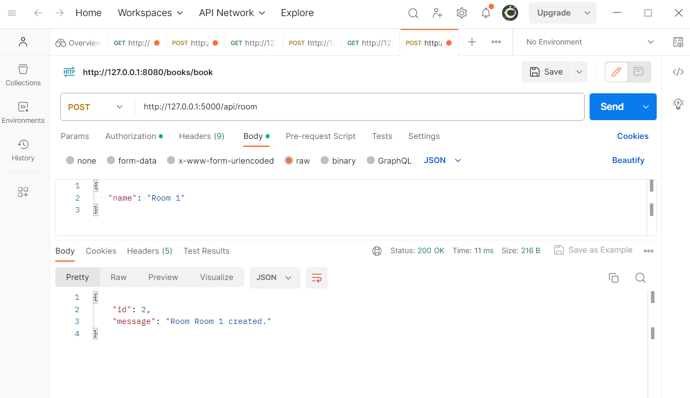
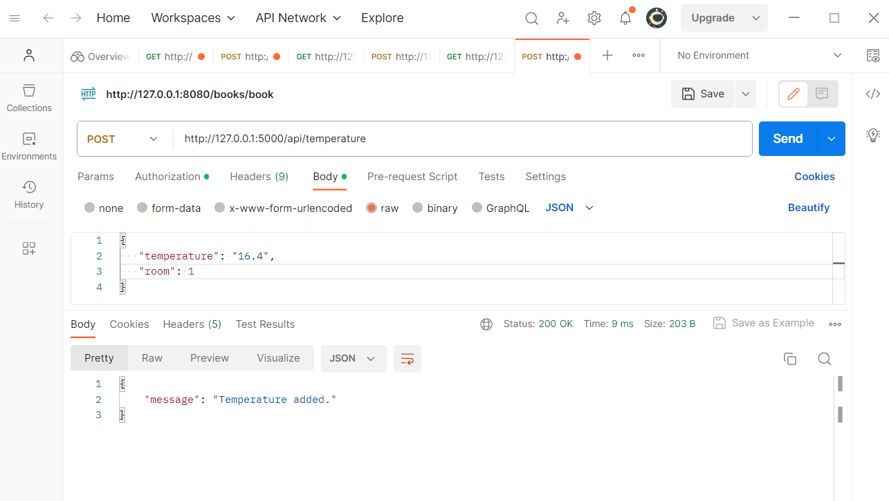
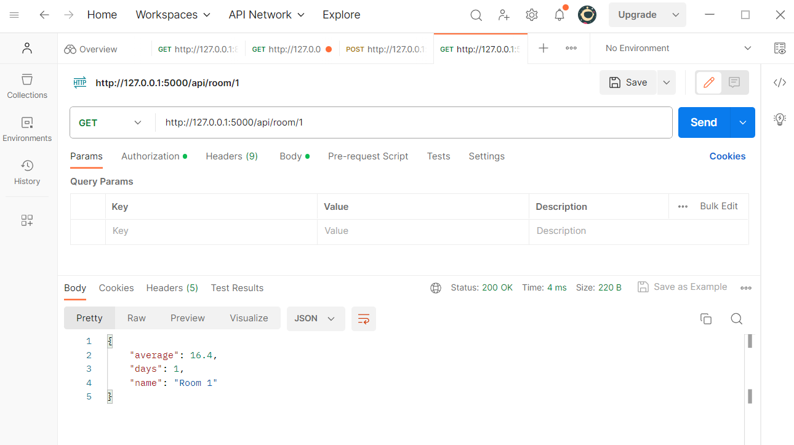

# Flask Postgres Demo
Sample project to illustrate postgres database interaction using flask app.





## Quickstart

Create a `.env` file with a `DATABASE_URL` variable that points to a PostgreSQL database.

- Create a Python virtual environment:

```
python -m venv .venv
```

- Activate the virtual environment and install the dependencies using `pip`:

```
source .venv/bin/activate  # for ubuntu
.\venv\Scripts\activate    # for windows
pip install -r requirements.txt
```

- Run the app:

```
python app.py
```